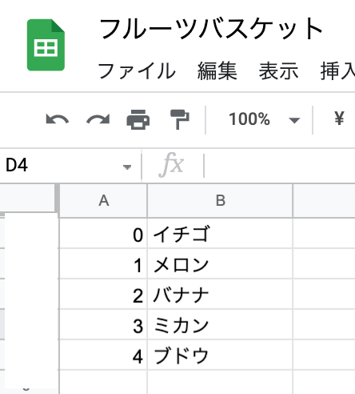

# 11/24 p5.jsでプログラミング/クリエイティブコーディング入門！

## 講義内容

- １、クリエイティブコーディング、p5.jsとは？
- ２、基礎編の復習。図形の描画。
- ３、変数を使ったアニメーション制作。
- ４、「ランダムウォーク」を作ってみよう。
- ５、繰り返し処理(for文)を使って大量の図形を表示させてみよう。
- ６、今後のプログラミング勉強方法について 

<br>
<br>

# １、クリエイティブコーディング、p5.jsとは？

クリエイティブ・コーディングとは，
**機能的ではなく表現力**のあるものを創造することを目指すコンピュータプログラミングの一種です。
(wikipediaより)
https://en.wikipedia.org/wiki/Creative_coding


計算やシステム制作ではなく、
ビジュアルを制作しながらプログラミングを学べるので、そのような種類に抵抗がある方も、<br>
楽しんで入門できるかと思います。（個人的にはシステム制作などもとても楽しいし、クリエイティブだと思っております。）<br>

↓様々なクリエイティブコーディングの紹介記事<br>
https://blog.creative-plus.net/archives/8171

<br>
<br>

## [OpenProcessing](https://openprocessing.org/)

p5.jsで制作したスケッチを投稿できるSNSのようなWebサービス。


<br>
<br>

今回はブラウザで動作するコードベースの **「p5.js」** といった環境を使用してプログラミングを学んでいきますが、<br>
コードを書かない「ビジュアルプログラミング」といった種類の環境も増えています。<br>

<br>


<br>
ビジュアルプログラミング例: TouchDesigner

ノードベースのビジュアルプログラミング環境。もともとはVJツールだけど、<br>
センサー連携などが容易で、インタラクティブ作品やメディアアートに使用されています。<br>
（私はあまり詳しくありませんが、、、。）<br>

公式サイト
https://derivative.ca/
<br>


<br>
<br>

# ２、基礎編の復習、図形の描画。

ではp5の入門しましょう！<br>
p5.jsエディターはこちら。（アカウントを作らないと保存できません。）
https://editor.p5js.org/

<br>
<br>

## p5入門!   circleを一つ描く

```
function setup() {

  // 横400px 縦400pxのキャンバスを作成する
  createCanvas(400, 400);
  
}

function draw() { 

  // x座標200、y座標200を中心に直径100pxの円を描く
  circle(200,200,100);
}
 ```

解説

**createCanvas()**
キャンバスのサイズを設定します。

```
// 横400px 縦400pxのキャンバスを作成する
createCanvas(400, 400);
```


## 座標について

左右をx座標、上下をy座標と呼びます。


画面はpxという単位のマス目で構成されています。 
ファミコンの初代マリオやドラゴンクエストのドットのイメージです。


<br>
<br>
setup()の中には、プログラム実行時に一度だけ動作してほしい内容を記述します。
canvasのサイズ設定や、最初の背景色など。
<br>
<br>
draw()の中には、プログラム実行時にずっと繰り返し動作してほしい内容を記述します。*
図形の描画や、座標の更新など。
<br>
<br>


<br>
↑アニメーション基礎を学びながら後ほど詳しく。
<br>
<br>

## 色の設定方法

```
function setup() {

  // 横400px 縦400pxのキャンバスを作成する
  createCanvas(400, 400);
  
}

function draw() { 

  // 赤
  fill(255,0,0,);

  // x座標200、y座標200を中心に直径100pxの円を描く
  circle(200,200,100);
}
 ```

パソコンのソフトウェアでは、RGBとCMYKという色指定用語が出てきます。<br>
液晶ディスプレイやデジタルカメラ、Web素材で RGBモード。<br>
プリンターや印刷物などで CMYKモードを使います。

**今回はRGBモード！（加法混色）**


<br>
<br>

それぞれの色要素を0~255で設定します。<br>
赤・緑・青を全部MAX255に設定すると、白になります。

色の設定（塗りつぶし）にはfill()という命令を使います。<br>
背景(もしくは全面塗りつぶしにがbackground()と言う命令を使います)<br>

    
    fill(R, G, B); // fill(赤の値, 緑の値, 青の値);
    
    // 赤
    fill(255,0,0);   // R 255、G 0、B 0 なので
    
    // 青
    fill(0,0,255);
    
    // 緑
    fill(0,255,0);
    
    background(R, G, B); // fill(赤の値, 緑の値, 青の値);
    


<br>
<br>

<br>
<br>


RGB確認ツール<br>
https://www.lab-nemoto.jp/236/

<br>
<br>


# ３、変数を使ったアニメーション制作。

簡易アニメーションを制作していきますが、「変数」という概念が必要になります。
<br><br>

<br>

## 変数とは？

その名の通り、変化する数。ですが、数字以外の「文字」やデータでも何でも入ります。<br>
ひとまず「pcのフォルダにデータを入れる、上書き保存も可能」というような理解でOKです。<br>
C言語やJavaScript、ほぼ全てのプログラム言語で利用可能な重要な概念です。<br><br>

let → 変数を使います！という宣言（新しいフォルダを作る）<br>
posX → 変数の名前を決める。posXでもpositionXでもbananaでも何でもOK（フォルダ名を決める）<br>
=20 → 値を格納する（代入する）。（フォルダにデータを入れる）<br>
<br>

<br>


先ほどのcircleに変数を使ってみる。
<br>


    // 変数の宣言
    // let 変数名 = 値;
    
    let posX = 200;
    
    function setup(){
      createCanvas(400,400);
      // 背景を白に
      background(255,255,255);
    }
    
    function draw(){
      // 黄色に
      fill(255,255,0);
      
      // posXの場所に円描く
      circle(posX,200,50);
    
    }


## アニメーションを作ってみる。

とりあえず書いてみる。


    // 変数の宣言
    // let 変数名 = 値;
    
    let posX = 200;
    
    function setup(){
      createCanvas(400,400);
      // 背景を白に
      background(255,255,255);
    }
    
    function draw(){
      // 黄色に
      fill(255,255,0);
      
      // posXの場所に円描く
      circle(posX,200,50);
      
      posX = posX+1;
    
    }


posXの座標を毎フレーム更新することによってアニメーションが制作できます。<br>
draw()の中に書くので1秒間に60回、posXが１ずつ増加します。


    posX = posX+1;
    // posXを1ずつ増加させます。先ほどの上書きの考え方。


結果


しかしこのままでは前のフレームの絵が残ってしまう、、、。


解決策、background()で毎回塗りつぶし、直前の絵をリセットする！<br>
**高速パラパラ漫画の考え方。**
黄色い丸　→ 真っ白 → 少し移動した黄色い丸 →　真っ白。<br>

イメージ。毎回真っ白な画像で塗りつぶす。<br>


drawの最初にこちらを挿入

    // 白で塗りつぶす
    background(255,255,255);

完成コード


    // 変数の宣言
    // let 変数名 = 値;
    
    let posX = 200;
    
    function setup(){
      createCanvas(400,400);
      // 背景を白に
      background(255,255,255);
    }
    
    function draw(){
      
      // 白で塗りつぶす
      background(255,255,255);
      
      // 黄色に
      fill(255,255,0);
      
      // posXの場所に円描く
      circle(posX,200,50);
      
      // 座標の更新
      posX = posX+1;
    }

<br>
<br>
## アニメーションに条件分岐( if文 )を使ってみる。
<br><br>
現状、丸は画面をはみ出すと消えてしまいますが、元に戻るようにしてみましょう。<br>
そこでif文を使用します。<br>
if文は「もし〜だったらこういう処理をする」といったように使用する条件分岐に使う命令分です。<br>
<br>
書き方↓<br>

```
if (条件) {
    条件を満たしていれば(真であれば)この中の処理を実行する。
}
```

今回は、丸が画面右端まで到達したら、また左端に戻したい。<br>
（posXの座標が画面右端まで到達したらまた元の位置の戻す）<br>
こちらをdrawの最後に記述してあげます。


```
// posXの値が400を超えたら再度0に戻す
if(posX > 400){
  posX = 0;
}
```

<br>
<br>

```
if ( posXが画面右端まで到達という条件を満たしていれば ) {
    posXを0に戻す。
}
```

<br>
if-else文、true,falseの概念などもありますが今回は入門なのでここまでにします。
↓if文について<br>
https://www.pasonatech.co.jp/workstyle/column/detail.html?p=2619


    // 変数の宣言
    // let 変数名 = 値;
    
    let posX = 100;
    
    function setup(){
      createCanvas(400,400);
      background(255,255,255);
    }
    
    function draw(){
      
      // 白で再度塗りつぶす
      background(255,255,255);
      
      // 青色に
      fill(0,0,255);
      
      // posXの場所に円描く
      circle(posX,200,50);
      
      // posXの値の更新
      posX = posX + 1;
      
      // posXの値が400を超えたら再度0に戻す
      if(posX > 400){
        posX = 0;
      }
      
    }
    

<br><br>

# ４、簡易ランダムウォークを作ってみよう。

ランダムウォーク( random walk）は、<br>
次に現れる位置が確率的に無作為(ランダム)に決定される運動である。(Wikipediaより)
<br>
<br>
クリエイティブコーディングの入門によく使われる運動です。
（この考え方をアレンジした作品にしたり、ウォーカーを増やしたコードにしたり）<br>

Wikipedia<br>
https://ja.wikipedia.org/wiki/%E3%83%A9%E3%83%B3%E3%83%80%E3%83%A0%E3%82%A6%E3%82%A9%E3%83%BC%E3%82%AF


　
randomという新しい命令が登場します。

```
    // 0~255のランダムな数値を設定してくれます。
    random(255);
    
    // 10以上、30未満のランダムな数字。範囲指定ver
    random(10,30)
```

<br>


```
    let posX = 200;
    let posY = 200;
    
    function setup() {
        createCanvas(500, 500);
        background(255,255,255);
    }
    
    function draw() {
        
        // 図形の枠線をなしに
        noStroke();
        fill(0,0,0,120);
    
        circle(posX,posY,5);
    
        // -5以上、5未満のランダムな数字を足してあげる
        posX = posX + random(-5,5);
        posY = posY + random(-5,5);
    }
```


改良すると面白いです。<br>
↓改良した表現
https://openprocessing.org/sketch/1269818/embed/


<br><br>

# ５、繰り返し処理(for文)を使って大量の図形を表示させてみよう。

<br><br>
for文という繰り返し処理を実行する命令を使ってダイナミックな表現を作ってみましょう。

公式

    for ([初期化式]; [条件式]; [加算式])

できるだけ優しい言葉で説明します。（最初は暗記がおすすめです。）


    // 10回繰り返す式
    for(let i=0; i<10; i++){
      // ここに実行する処理
    }

１、まずはforという()で括ります。

    for(){
    }

２、現在何回繰り返したか把握する、カウント用変数を作ります。（for文の中でしか使いません）<br>
「i」という名前を使うことが多いです。インクリメントの「i」 説。<br>
(先ほどのposXと同じ定義方法です。）let i= 0;

    for(let i = 0; ){
    }

３、何回繰り返すか設定します。(iの数をいくつまで数えるか)<br>
今回はi<10なので、iが10未満まで、0~9の10回実行します。<br>
（注: プログラミングの世界では、カウントを0から数えます！）<br><br>


    for(let i = 0; i<10; ){
      
    }

４、カウント用変数（今回はiの値）を加算してあげます。<br>
i++というのはiが１ずつ増加するという意味です。<br>

    for(let i = 0; i<10; i++){
    
    }

ひとまず最初のうちは理解が難しいと思うので、、暗記してください。<br>

    for(let i=0; i<繰り返したい回数; i++){
      // 実行内容
    }


## for文を使って、大量に円を表示させてみる

今回は1度のみの描画が良いのでsetupの方に記述してください。<br>
drawは空白か消去で大丈夫です。<br>

<br>


    function setup(){
      
      createCanvas(500,500);
      
      // 30回繰り返す
      for(let i=0; i<30; i++){
        
        // randomな色に設定
        fill(random(255),random(255),random(255));
        
        // randomな位置とサイズを設定
        circle(random(500),random(500),random(50)); 
      }
      
    }


200個にしてみましょう。<br>
30を200に変更するだけです。一気に結果が変わります。<br>
<br>


<br>
<br>
if文との合わせ技で、前半100回を円に、後半100回を四角にしてみましょう。

    
    function setup(){
    
      createCanvas(500,500);
      
      // 200回繰り返す
      for(let i=0; i<200; i++){
        // randomな色に設定
        fill(random(255),random(255),random(255));
        
        if(i<100){
          // 前半100回は円を描画
          circle(random(500),random(500),random(50));
        }
        else{
          // 後半100回は四角を描画
          rect(random(500),random(500),random(50))
        }
      }
    
    }


<br>
アレンジver 透明度もランダムに
<br>


    fill(R,G,B,A);
    fill(random(255),random(255),random(255),random(255));
    // fillの4番目には透明度が設定可能 0~MAX244
    
    


<br>


    fill(random(255),random(255),random(255),random(40));

透明度もランダムに！（低めに絞る）
<br>


noStoke()で枠線なしに！
<br>


<br><br>

# ６、今後のプログラミング勉強方法について

自分のモチベーションの上がる環境、作りたい物に適した言語やツールを選ぶと良いと思います。<br>
しかし、納得いく思った通りの物が作れるようになるまでは、数年かかると思います。<br>
（終わりがないかも、、）<br>
一度色々な環境に触れてみても良いかもしれませんが、個人的には自分がコレ！と決めたツールや言語としばらくじっくり向き合うと良いと思います。<br>
その言語やツールで覚えたプログラミング手法や考え方は、必ず別のツールでも生かせます。<br>
変数やif文などは全ての言語で出てくるし、コードはコピペできないけど、考え方はコピペできます。<br>
モチベーションや情熱のアップダウンはあると思いますが、興味を持ち続けることが大切だと思います。<br>
例を挙げます。<br>


Webサイトを作りたい

- HTMLとCSS(正確にはマークアップ言語)
- JavaScript

Webサービスを作りたい

- HTMLとCSS(正確にはマークアップ言語)
- JavaScript(フレームークも)
- PHPなどサーバーサイドの言語

インタラクティブ作品、VJをやりたい

- タッチデザイナー
- Unity

VRやARを作りたい

- Unity

スマホゲームが作りたい

- Unity
- Swift

子供と楽しくプログラミングしたい

- scratch
- scratch jr


コードを書くのが苦手だった、、、

- タッチデザイナー
- scratch
- デザインを極める 笑


プログラミング、クリエイティブコーディングに興味を持つきっかけになれば幸いです。<br>
本日はありがとうございました！

